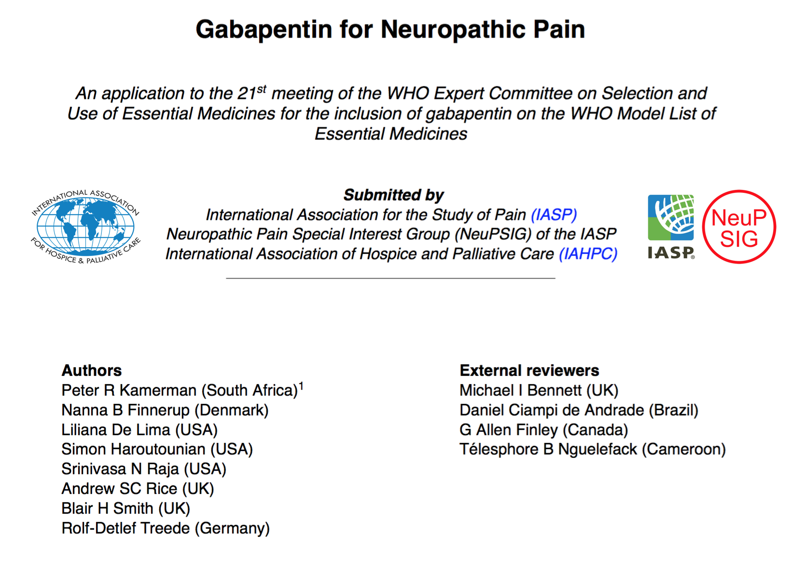

```{r setup, include = FALSE, warning = FALSE, message = FALSE}
library(flexdashboard)
library(dplyr)
library(tibble)
library(tidyr)
library(ggplot2)
library(ggiraph)
library(viridis)
library(scales)
library(highcharter)
library(leaflet)
library(sp)

knitr::opts_chunk$set(cache = FALSE,
                      fig.cap = TRUE,
                      fig.align = 'center')

```

### **Neuropathic pain** is estimated to affect **7 to 10%** of adults globally [$^1$](http://www.ncbi.nlm.nih.gov/pubmed/24291734). This translates into about **518 to 740 million** affected individuals. {data-commentary-width=400}

```{r prevalence}
# Load data
load('./data/prevalence_plot.RData')

# Plot
prevalence_plot <- ggplot(data = plot_data[-7, ]) + # Omit 'All combined' data
    aes(fill = n_total, colour = n_total, 
        data_id = study, tooltip = tooltip) +
    # All combined rectangle
    #geom_rect(data = plot_data[7, ],
    #          aes(xmin = 0.5, xmax = 6.5,
    #              ymin = lowerCI, ymax = upperCI),
    #          fill = '#FFFFFF', colour = '#FFFFFF',
    #          alpha = 1) +
    #geom_rect_interactive(data = plot_data[7, ],
    #                      aes(xmin = 0.5, xmax = 6.5,
    #                          ymin = lowerCI, ymax = upperCI,
    #                          fill = n_total, data_id = study, 
    #                          tooltip = tooltip),
    #                      alpha = 0.5,
    #                      linetype = 0) +
    # All combined CI boundry
    #geom_segment_interactive(data = plot_data[7, ],
    #                         aes(x = 0.5, xend = 6.5, 
    #                             y = upperCI, yend = upperCI,
    #                             colour = n_total, data_id = study, 
    #                             tooltip = tooltip),
    #                         size = 0.2,
    #                         linetype = 3) +
    #geom_segment_interactive(data = plot_data[7, ],
    #                         aes(x = 0.5, xend = 6.5, 
    #                             y = lowerCI, yend = lowerCI,
    #                             colour = n_total, data_id = study, 
    #                             tooltip = tooltip),
    #                         size = 0.2,
    #                         linetype = 3) +
    # All combined mean
    geom_segment_interactive(data = plot_data[7, ],
                             aes(x = 0.5, xend = 6.5, 
                                 y = bstrp_prev, yend = bstrp_prev,
                                 colour = n_total, data_id = study, 
                                 tooltip = tooltip),
                             size = 1,
                             linetype = 2) +
    # Add white background rectangles (95%CI limits)
    geom_rect_interactive(aes(xmin = xmin, xmax = xmax, 
                              ymin = lowerCI, ymax = upperCI),
                          size = 1,
                          fill = '#FFFFFF',
                          color = '#FFFFFF',
                          alpha = 1) +
    # Add rectangles (95%CI limits)
    geom_rect_interactive(aes(xmin = xmin, xmax = xmax, 
                              ymin = lowerCI, ymax = upperCI),
                          size = 1,
                          alpha = 0.6) +
    # Add Point prevalence
    geom_segment_interactive(aes(x = xmin, xend = xmax,
                                 y = prevalence, yend = prevalence), 
                             size = 1) +
    # Add overall mean
    # geom_segment_interactive(data = plot_data[7, ],
                             # aes(x = 0, xend = 7,
                             #     y = prevalence, yend = prevalence), 
                             # size = 2,
                             # color = '#E69F00') +
    # Add max range bar
    geom_segment_interactive(aes(x = x_segment, xend = x_segment,
                                 y = upperCI, yend = max), 
                             size = 1) +
    # Add min range bar
    geom_segment_interactive(aes(x = x_segment, xend = x_segment,
                                 y = lowerCI, yend = min), 
                             size = 1) +
    # Add 'T's to capping min/max segments bar ends
    geom_segment_interactive(aes(x = bar_1, xend = bar_2,
                                 y = max, yend = max), 
                             size = 1) +
    geom_segment_interactive(aes(x = bar_1, xend = bar_2,
                                 y = min, yend = min), 
                             size = 1) +
    # Set colours
    scale_fill_viridis(name = 'Sample\nsize (n)\n',
                       limits = c(0, 40000),
                       breaks = c(0, 10000, 20000, 30000, 40000),
                       labels = c("0", "10,000", "20,000", "30,000", "40,000"),
                       end = 0.95, direction = -1) +
    scale_color_viridis(name = 'Sample\nsize (n)\n',
                       limits = c(0, 40000),
                       breaks = c(0, 10000, 20000, 30000, 40000),
                       labels = c("0", "10,000", "20,000", "30,000", "40,000"),
                       end = 0.95, direction = -1) +
    # Set axis scales
    scale_y_continuous(limits = c(0, 0.1 + max(plot_data$max))) +
    scale_x_continuous(breaks = c(1, 2, 3, 4, 5, 6),
                       labels = c('United\nKingdom', 'France',
                                  'Alberta,\nCanada', 'Minnesota,\nUSA',
                                  'Maranhão,\nBrazil', 'Morocco')) + 
    # Label axes
    labs(title = 'Prevalence of neuropathic pain in the general (adult) population\n',
         y = 'Prevalence of neuropathic pain (%)\n') +
    # Customize theme options
    theme(panel.background = element_blank(),
          panel.grid.major = element_line(color = '#999999', size = 0.2),
          legend.text = element_text(size = 12),
          legend.title = element_text(size = 14),
          plot.title = element_text(size = 16),
          axis.ticks = element_line(color = '#999999', size = 0.2),
          axis.title.x = element_blank(),
          axis.title.y = element_text(size = 16),
          axis.text.y = element_text(size = 14),
          axis.text.x = element_text(size = 14))

# Make ggplot interactive with ggiraph htmlwidget
ggiraph(code = {print(prevalence_plot)}, 
        width_svg = 8, height_svg = 5,
        tooltip_extra_css = tooltip_css,
        tooltip_opacity = 1,
        hover_css = hover_css)

# Clear environment
rm(list = ls())
```

****

Neuropathic pain is caused by damage to the sensory pathways and structures of the nervous system. This damage may occur as a result of physical trauma to the nervous system _(e.g., motor vehicle accidents, war-related trauma to combatants and non-combatants, surgery)_, or as a secondary consequence of other medical conditions _(e.g., diabetes mellitus, HIV, malnutrition, stroke, tumours)_ and their treatments _(e.g., cancer chemotherapy)_. 

Clinical features of the pain often include symptoms such as pins-and-needles, burning or shooting pain, and altered sensation _(e.g., numbness, and pain in response to light touch)_.

****

##### Plot: Prevalence of neuropathic pain in the general population

The _center horizontal lines_ show the reported prevalence of neuropathic pain. The _boxes_ show the bootstrap 95% confidence interval of the prevalence (10,000 resamples), and the _whiskers_ show the maximum and minimum values obtained from the resampling. The _dashed line_ shows the bootstrap mean across all six studies (n = 38,422), and _line & fill colour_ quantifies the sample size. 

_(Click the flag to access the related PubMed entry)_  

<a href="http://www.ncbi.nlm.nih.gov/pubmed/16618472" target="_blank"></a>
<a href="http://www.ncbi.nlm.nih.gov/pubmed/17888574" target="_blank"></a>
<a href="http://www.ncbi.nlm.nih.gov/pubmed/19594844" target="_blank"></a>
<a href="http://www.ncbi.nlm.nih.gov/pubmed/20849570" target="_blank"></a>
<a href="http://www.ncbi.nlm.nih.gov/pubmed/22871508" target="_blank"></a>
<a href="http://www.ncbi.nlm.nih.gov/pubmed/23241023" target="_blank"></a>

<p style="float:right;font-size:80%;">Created by: 
    <a href="http://painblogr.org" target="_blank">painblogR</a> 
    </a>
</p>


<!-- Extra panel

### There is **significant variation** in the prevalence of neuropathic pain **within and between conditions** that cause damage to the somatosensory nervous system [$^REF$](http://www.ncbi.nlm.nih.gov/pubmed/18211592). {data-commentary-width=400}

```{r conditions, echo = FALSE, eval = FALSE}
# Load data
load('./data/conditions_plot.RData')

# Plot
conditions_plot <- ggplot(plot_data) +
    aes(fill = condition, colour = condition,
        x = condition, data_id = condition, tooltip = tooltip) +
    # Add white background rectangles
    geom_rect(aes(ymin = lower_range, 
                  ymax = upper_range), 
              xmin = as.numeric(plot_data$condition) - 0.25,
              xmax = as.numeric(plot_data$condition) + 0.25,
              size = 1,
              fill = '#FFFFFF',
              color = '#FFFFFF',
              alpha = 1) +
    # Add interactive prevalence rectangles
    geom_rect_interactive(aes(ymin = lower_range, 
                              ymax = upper_range), 
                          xmin = as.numeric(plot_data$condition) - 0.25,
                          xmax = as.numeric(plot_data$condition) + 0.25,
                          alpha = 0.6,
                          size = 1) +
    # Set scales
    scale_y_continuous(limits = c(0, 100)) +
    # Set colours
    scale_fill_manual(values = pal) +
    scale_colour_manual(values = pal) +
    # Flip the plot 90-degrees
    coord_flip() +
    # Add labels
    labs(title = 'Prevalence ranges of neuropathic pain reported\nfor various causes of nervous system injury',
         y = '\nPercent painful neuropathy (%)') +
    # Customize theme
    theme(panel.background = element_blank(),
          panel.grid.major = element_line(color = '#999999', size = 0.2),
          legend.position = 'none',
          plot.title = element_text(size = 16),
          axis.ticks = element_line(color = '#999999', size = 0.2),
          axis.title.x = element_text(size = 16),
          axis.title.y = element_blank(),
          axis.text.y = element_text(size = 14),
          axis.text.x = element_text(size = 14))

# Make ggplot interactive with ggiraph htmlwidget
ggiraph(code = {print(conditions_plot)}, 
        width_svg = 8, height_svg = 5,
        tooltip_extra_css = tooltip_css,
        tooltip_opacity = 1,
        hover_css = hover_css)

# Clear environment
rm(list = ls())
```

****

Not every case of damage to the somatosensory nervous system results in neuropathic pain. Indeed, why some people, but not others, develop neuropathic pain after a seemingly similar injury _(e.g., diabetic polyneuropathy)_ is unclear. 

However, some causes of damage to the somatosensory nervous system are associated with greater risk of developing neuropathic pain. For example, the prevalence of neuropathic pain associated with stroke is much lower than that associated with nerve damage caused by HIV infection/treatment. 

****

##### Plot: Prevalence of neuropathic pain across several common causes of nervous system injury

The _horizontal bars_ show the range of prevalence values reported for various causes of central and peripheral nervous system injury [$^REF$](http://www.ncbi.nlm.nih.gov/pubmed/18211592). Note the differences in prevalence of neuropathic pain across the seven conditions, and the variation in prevalence reported within each condition. 

<p style="font-size:80%;"><b>*</b> Values for HIV polyneuropathy and diabetic polyneuropathy report the percentage of individuals with HIV infection or diabetes mellitus as such, and not the subset of indivduals with those diasease that develop a neuropathy. <b>**</b> Values for post-herpetic neuralgia report the percentage of individuals with <em>Herpes zoster (shingles)</em> that go on to develop post-herpetic neuralgia.</p>  

<p style="float:right;font-size:80%;">Created by: 
    <a href="http://painblogr.org" target="_blank">painblogR</a> 
    </a>
</p>

-->


### The burden of neuropathic pain is likely to increase in the future, with **developing countries possibly being worst affected**. {data-commentary-width=400}

```{r burden}
# Load data
load('./data/burden_plot.RData')

# Plot
burden_plot <- ggplot(data = data_burden) +
    aes(x = year) +
    # Projected values rectangle
    geom_rect(aes(xmin = 2014, xmax = 2035,
                  ymin = 0, ymax = 600,
                  fill = 'one'),
              size = 0,
              alpha = 1) +
    # DM burden segments (path)
    geom_path(aes(y = dm), 
              size = 1,
              colour = '#1776b7') +
    # DM burden background points
    geom_point(aes(y = dm),
               size = 6, 
               stroke = 1,
               alpha = 1,
               colour = '#FFFFFF') +
    # DM burden
    geom_point_interactive(aes(y = dm, 
                               colour = 'two', # dummy variable
                               tooltip = tooltip_dm,
                               data_id = dm),
                           size = 4,
                           stroke = 1,
                           alpha = 0.6) + 
    # DPN polygon
    geom_polygon(data = data_polygon,
                 aes(x = x, y = y),
                 size = 0,
                 alpha = 0.6, 
                 fill = '#e17f00') +
    # DPN upper burden segments (path)
    geom_path(aes(y = dpn_upper), 
              size = 1,
              colour = '#e17f00') +
    # DPN upper burden background points
    geom_point(aes(y = dpn_upper),
               size = 6, 
               stroke = 1,
               alpha = 1,
               colour = '#FFFFFF') +
    # DPN upper burden
    geom_point_interactive(aes(y = dpn_upper, 
                               colour = 'three', # dummy variable
                               tooltip = tooltip_upper,
                               data_id = dpn_upper),
                           size = 4,
                           stroke = 1,
                           alpha = 0.6) + 
    # DPN lower burden segments (path)
    geom_path(aes(y = dpn_lower), 
              size = 1,
              colour = '#e17f00') +
    # DPN lower burden background points
    geom_point(aes(y = dpn_lower),
               size = 6, 
               stroke = 1,
               alpha = 1,
               colour = '#FFFFFF') +
    # DPN lower burden
    geom_point_interactive(aes(y = dpn_lower, 
                               tooltip = tooltip_lower,
                               data_id = dpn_lower),
                           size = 4,
                           stroke = 1,
                           alpha = 0.6,
                           colour = '#e17f00',
                           fill = '#e17f00') +
    # Add colour scale for legend
    scale_color_manual(labels = c('two' = paste('Diabetes mellitus (DM)'),
                                  'three' = 'Painful diabetic\npolyneuropathy (DPN)\n(prevalence estimate:\n10-20% of diabetics)'),
                       values = c('two' = '#1776b7', 
                                  'three' = '#e17f00')) +
    scale_fill_manual(labels = c('one' = 'Projection period\n(2014-2035)'),
                      values = c('one' = '#d6d6d6')) +
    # Labels
    labs(title = 'Projected global burden of diabetes mellitus\nand painful diabetic polyneuropathy\n',
         y = '\nMillions of people\n',
         x = '\nYear') +
    # Customize theme
    theme(legend.title = element_blank(),
          legend.text = element_text(size = 12),
          legend.key = element_rect(fill = '#FFFFFF'),
          legend.key.height = unit(20, 'mm'),
          panel.background = element_blank(),
          panel.grid.major = element_line(color = '#999999', 
                                          size = 0.2),
          plot.title = element_text(size = 16),
          axis.ticks = element_line(color = '#999999', 
                                    size = 0.2),
          axis.title = element_text(size = 16),
          axis.text = element_text(size = 14))

# Make ggplot interactive with ggiraph htmlwidget
ggiraph(code = {print(burden_plot)}, 
        width_svg = 8, height_svg = 5,
        tooltip_extra_css = tooltip_css,
        tooltip_opacity = 1,
        hover_css = hover_css)

# Clear environment
rm(list = ls())

```

****

Two persistent global trends are an aging population [$^2$](http://www.un.org/en/development/desa/population/publications/pdf/ageing/WPA2015_Report.pdf) and the rising prevalence of diabetes mellitus [$^3$](http://ncbi.nlm.nih.gov/pubmed/24630390). Both of these factors are major risk factors for neuropathic pain, and mean that neuropathic pain is likely to increase in prevalence and importance in the future.  

Developing countries have the highest rates of increase in population aging and cases of diabetes mellitus. Moreover, these countries face a greater burden of disease from other common causes of neuropathic pain such as trauma, HIV/AIDS, and leprosy than do developed countries [$^4$](http://www.healthdata.org/gbd/data). Thus, more poorly resourced nations are likely to increasingly shoulder a disproportionate share of the global burden of neuropathic pain as the century progresses.  

****

##### Plot: Estimated and projected global burden of diabetes mellitus and painful diabetic polyneuropathy

Estimated number of cases of diabetes mellitus _(blue)_ and painful diabetic polyneuropathy (DPN) _(orange)_ between 1985 and 2013. Projected number of cases for the period up to 2035 are highlighted in the _gray_ block [$^5$](http://ncbi.nlm.nih.gov/pubmed/24630390). The number of DPN cases are based on conservative estimates of between 10 and 20% of individuals with diabetes mellitus developing a painful neuropathy [$^6$](http://ncbi.nlm.nih.gov/pubmed/18828198).

<p style="margin-bottom:2%;float:right;font-size:80%;">Created by: 
    <a href="http://painblogr.org" target="_blank">painblogR</a> 
    </a>
</p>


### Neuropathic pain has a **significant adverse impact on life, health and function**; even more so than other causes of chronic pain [$^7$](http://www.ncbi.nlm.nih.gov/pubmed/17237663). {data-commentary-width=400}

```{r impact}

highchart() %>%
    hc_chart(polar = TRUE, type = 'line') %>%
    hc_tooltip(backgroundColor = '#333333', 
               borderRadius = 10,
               borderColor = '#999999', 
               useHTML = TRUE,
               headerFormat = '<span style="padding:10px;font-family:Arial;font-size:11pt; font-weight:bold;line-height:1.1">{point.key}</span><br>',
               pointFormat = '<span style="padding:10px;font-family:Arial;font-size:11pt;font-style:italic;font-weight:normal;;line-height:1.3">{series.name}: </span><span style="font-family:Arial;font-size:11pt;font-style:normal;font-weight:normal;;line-height:1.3">{point.y}</span><br>',
               shadow = FALSE,
               shared = TRUE,
               valueDecimals = 1, 
               style = list(color = '#FFFFFF')) %>%
    hc_title(useHTML = TRUE,
             text = '<span style="font-size:20;color:#000000">Health-related quality of life in people with and without chronic pain</span><br><span style="font-size:65%;font-style:italic;">(Short Form (SF)-36 Health Survey; 0  = worst possible health state, 100 = best possible health state)</span>') %>%
    hc_xAxis(categories = c('Physical functioning', 'Role limitations (physical)',
                            'Bodily pain', 'General health',
                            'Vitality', 'Social functioning',
                            'Role limitations (emotional)', 'Mental health'),
             labels = list(style = list(fontSize = 16,
                                        color = '#4d4d4d')),
             tickmarkPlacement = 'on',
             lineWidth = 0) %>%
    hc_yAxis(gridLineInterpolation = 'polygon',
             lineWidth = 0,
             min = 0, max = 100,
             tickInterval = 20) %>%
    hc_legend(itemStyle = list(fontWeight = 'normal',
                               color = '#000000',
                               fontSize = 15),
              align = 'right',
              verticalAlign = 'middle',
              layout = 'vertical') %>%
    hc_colors(colors = c('#009E73', '#377EB8', '#FF7F00')) %>%
    hc_add_series(name = 'No chronic pain',
                  data = c(89.4, 88.1, 84.8, 75.6, 65.6, 87.1, 86.9, 76.7),
                  marker = list(symbol = 'circle', radius = 8, 
                                states = 
                                    list(hover = list(fillColor = '#FFFFFF', 
                                                      lineColor = '#009E73',
                                                      lineWidth = 2,
                                                      lineWidthPlus = 0,
                                                      radiusPlus = 0))),
                  states = list(hover = list(halo = FALSE)),
                  lineWidth = 2, 
                  pointPlacement = 'on') %>%
    hc_add_series(name = 'Other chronic pain',
                  data =  c(72.8, 65.0, 55.8, 60.4, 52.8, 74.3, 74.6, 70.6),
                  marker = list(symbol = 'circle', radius = 8, 
                                states = 
                                    list(hover = list(fillColor = '#FFFFFF', 
                                                      lineColor = '#377EB8',
                                                      lineWidth = 2,
                                                      lineWidthPlus = 0,
                                                      radiusPlus = 0))),
                  states = list(hover = list(halo = FALSE)),
                  lineWidth = 2, 
                  pointPlacement = 'on') %>%
    hc_add_series(name = 'Neuropathic pain',
                  data = c(58.5, 40.1, 41.0, 49.2, 42.6, 58.6, 57.3, 62.6),
                  marker = list(symbol = 'circle', radius = 8, 
                                states = 
                                    list(hover = list(fillColor = '#FFFFFF', 
                                                      lineColor = '#FF7F00',
                                                      lineWidth = 2,
                                                      lineWidthPlus = 0,
                                                      radiusPlus = 0))),
                  states = list(hover = list(halo = FALSE)),
                  lineWidth = 2, 
                  pointPlacement = 'on')

````

****

Neuropathic pain has a significant adverse impact on all measured aspects of life, health and function. This impact is greater than the impact of chronic, non-neuropathic pain, even when adjusting for pain intensity [$^7$](http://www.ncbi.nlm.nih.gov/pubmed/17237663). In one study, 17% of people reporting neuropathic pain rated their quality of life as _‘worse than death’_, according to the validated EQ5D health-related quality of life measure [$^8$](http://www.ncbi.nlm.nih.gov/pubmed/25020004). The average quality of life scores in the presence of neuropathic pain are comparable to those in severe depression, in poorly-controlled diabetes mellitus, and after recent myocardial infarction [$^7$](http://www.ncbi.nlm.nih.gov/pubmed/17237663).

****

##### Plot: Health-related quality of life in people with and without chronic pain

Ratings of health-related quality of life from a population survey in Scotland [$^7$](http://www.ncbi.nlm.nih.gov/pubmed/17237663). Ratings are shown for people without chronic pain _(green, n = 1,537)_, with chronic non-neuropathic pain _(blue, n = 1,179)_, and chronic neuropathic pain _(orange, n = 241)_. Across all eight domains, having neuropathic pain was associated with significantly poorer quality of life compared to having no chronic pain or having chronic non-neuropathic pain.

<p style="margin-bottom:2%;float:right;font-size:80%;">Created by: 
    <a href="http://painblogr.org" target="_blank">painblogR</a> 
    </a>
</p>


### Neuropathic pain can be **difficult to treat**. It responds poorly to treatment with conventional analgesics, but there are specific classes of drugs with proven efficacy in managing the pain [$^9$](http://www.ncbi.nlm.nih.gov/pubmed/25575710). {data-commentary-width=450}

```{r treatment}
# Load data
load('./data/treatment_plot.RData')

# Plot
nnt_plot <- ggplot(data = nnt_data) +
    aes(x = nnt, y = drug, 
        color = participants, fill = participants,
        data_id = tooltip_drug, tooltip = tooltip)  +
    # Interactive CI segments
    geom_segment_interactive(aes(x = nnt, 
                                 xend = upperCI,
                                 y = drug, 
                                 yend = drug),
                             size = 1) +
    geom_segment_interactive(aes(x = nnt, 
                                 xend = lowerCI,
                                 y = drug, 
                                 yend = drug),
                             size = 1) +
    # 'T' bar ends for segments
    # Interactive CI segments
    geom_segment_interactive(aes(x = lowerCI, 
                                 xend = lowerCI),
                             # position according to reverse order of 
                             # x-axis categories
                             y = c(4, 1, 2, 3) + 0.1,
                             yend = c(4, 1, 2, 3) - 0.1,
                             size = 1) +
    geom_segment_interactive(aes(x= upperCI, 
                                 xend = upperCI),
                             # position according to reverse order of 
                             # x-axis categories
                             y = c(4, 1, 2, 3) + 0.1, 
                             yend = c(4, 1, 2, 3) - 0.1,
                             size = 1) +
    # White background for points
    geom_point(size = 8,
               stroke = 1, 
               color = '#FFFFFF',
               alpha = 1,
               show.legend = FALSE) +
    # Interactive points
    geom_point_interactive(size = 8,
                           stroke = 1,
                           alpha = 0.6,
                           show.legend = FALSE) +
    # Set axis scale
    scale_x_continuous(limits = c(0, 10),
                       breaks = c(0, 2, 4, 6, 8, 10)) +
    # Set colours
    scale_fill_viridis(name = 'Number of trial\nparticipants\n',
                       limits = c(0, 6000),
                       breaks = c(0, 2000, 4000, 6000),
                       labels = c("0", "2,000", "4,000", "6,000"),
                       end = 0.9, direction = -1) +
    scale_color_viridis(name = 'Number of trial\nparticipants\n',
                       limits = c(0, 6000),
                       breaks = c(0, 2000, 4000, 6000),
                       labels = c("0", "2,000", "4,000", "6,000"),
                       end = 0.90, direction = -1) +
    labs(title = 'Recommended first-line treatments for neuropathic pain\n',
         x = '\nNumber needed to treat (NNT, 95% CI)\u2020') +
    theme(panel.background = element_blank(),
          panel.grid.major = element_line(color = '#999999',
                                          size = 0.2),
          legend.text = element_text(size = 12),
          legend.title = element_text(size = 14),
          plot.title = element_text(size = 16),
          axis.ticks = element_line(color = '#999999', 
                                    size = 0.2),
          axis.title.y = element_blank(),
          axis.title.x = element_text(size = 16),
          axis.text.y = element_text(size = 14),
          axis.text.x = element_text(size = 14))

# Make ggplot interactive with ggiraph htmlwidget
ggiraph(code = print(nnt_plot),
        width_svg = 8, height_svg = 5.5,
        tooltip_extra_css = tooltip_css,
        tooltip_opacity = 1,
        hover_css = hover_css)

# Clear environment
rm(list = ls())

````

****

A recent [GRADE](http://www.gradeworkinggroup.org) assessment of pharmacological treatments for neuropathic pain recommended [$^9$](http://www.ncbi.nlm.nih.gov/pubmed/25575710):

- FIRST LINE: Tricyclic antidepressants _(e.g., amitriptyline)_, serotonin and noradrenaline reuptake inhibitors _(duloxetine, venlafaxine)_, and $\alpha2\delta$-calcium channel ligands _(gabapentin, pregabalin)_. 

- SECOND LINE: Tramadol, 5% lidocaine patches $^\dagger$, 8% capsaicin patches $^\dagger$.

- THIRD LINE: Strong opioids _(e.g., morphine and oxycodone)_, and botulinium toxin A $^\dagger$.  

<p style="font-size:80%;">$\dagger$: Recommended for neuropathic pain of peripheral origin only</p>

****

##### Plot: Recommended first-line treatments for neuropathic pain

Point estimates and 95% confidence intervals of the number needed to treat (NNT) for first-line therapies for neuropathic pain. The _shading colour_ quantifies the total number of people included in randomized control trials involving each drug/drug class.   


<p style="font-size:80%;"><span style="font-size:100%">&dagger;</span>: [NNT](http://www.medicine.ox.ac.uk/bandolier/painres/download/whatis/nnt.pdf) quantifies the effectiveness of an intervention in terms of the number of people that need to be treated with a drug before one person achieves significant benefit relative to the control _(1 is the best NNT)_. Here, significant benefit was defined as at least 50% pain reduction compared to placebo, and NNT values > 11 were considered as no clinically significant benefit.</p>


<p style="margin-bottom:2%;float:right;font-size:80%;">Created by: 
    <a href="http://painblogr.org" target="_blank">painblogR</a> 
    </a>
</p>


### **National essential medicines lists** of developing countries typically do not provide good coverage of the recommended pharmacological treatments [$^{10}$](http://www.ncbi.nlm.nih.gov/pubmed/25894010). {data-commentary-width=400}

```{r access}
# Load data
load('./data/access_plot.RData')

# Plot
leaflet(data = geo_data) %>%
    setView(lat = 10, lng = 0, zoom = 2) %>%
    addProviderTiles('CartoDB.PositronNoLabels') %>%
    addPolygons(weight = 1, color = '#000000',
                opacity = 1, fillColor = ~ pal_first(factor_first),
                fillOpacity = 1, popup = popup_first,
                group = 'First-line drug classes') %>%
    addPolygons(weight = 1, color = '#000000',
                opacity = 1,fillColor = ~ pal_second(factor_second),
                fillOpacity = 1, popup = popup_second,
                group = 'Second-line drug classes') %>%
    addPolygons(weight = 1, color = '#000000',
                opacity = 1, fillColor = ~ pal_third(factor_third),
                fillOpacity = 1, popup = popup_third,
                group = 'Third-line drug classes') %>%
    addPolygons(weight = 1, color = '#000000',
                opacity = 1, fillColor = ~ pal_income(imf),
                fillOpacity = 1, group = 'IMF income group') %>%
    addLayersControl(baseGroups = c('First-line drug classes',
                                    'Second-line drug classes',
                                    'Third-line drug classes',
                                    'IMF income group'),
                     options = layersControlOptions(collapsed = FALSE)) %>%
    # Added new class to leafletfix.css - .info-small with smaller font size
    addLegend("topleft", pal = pal_first, values = ~ factor_first,
              title = "No. of 1st-line classes on NEML <br><em>(TCA, &alpha;2&delta;-ligand, SNRI)<sup>&dagger;</sup></em>",
              className = 'info-small legend-small', opacity = 1) %>%
    addLegend("bottomleft", pal = pal_third, values = ~ factor_third,
              title = "No. of 3rd-line classes on NEML <br><em>(strong opioid, other agent)<sup>&#8277;</sup></em>", className = 'info-small legend-small',
              opacity = 1) %>%
    addLegend("bottomleft", pal = pal_second, values = ~ factor_second,
              title = "No. of 2nd-line classes on NEML <br><em>(weak opioid, topical agent)<sup>&Dagger;</sup></em>",className = 'info-small legend-small',
              opacity = 1) %>%
    addLegend("bottomright", pal = pal_income, values = ~ imf,
              title = "IMF income category", className = 'info-small legend-small',
              opacity = 1)

# Clear environment
rm(list = ls())

````

****

The [WHO](http://apps.who.int/gb/ebwha/pdf_files/WHA67/A67_31-en.pdf) has urged its members to ensure, _\"the availability of essential medicines for the management of symptoms, including pain\"_. But, a recent audit of 112 national essential medicines lists (NEML) identified that ~66% of countries had only one class of first-line agent (typically tricyclic antidepressants), and ~50% had only one second-line agent (typically tramadol, a weak opioid), included on their NEMLs [$^{10}$](http://www.ncbi.nlm.nih.gov/pubmed/25894010). 
This means that should a patient fail to respond to initial therapy, have significant side effects, or have contraindications to a drug’s use, there are no or limited alternative agents available to switch to, or add-on to the initial agent. 

****

##### Plot: NEML-listed drug classes recommended as 1st, 2nd, or 3rd-line therapy for treating neuropathic pain.

Colour intensity indicates number of drug classes listed on a countries NEML. Choose the recommendation level you want to assess in the top-right corner of the plot. Click on a country of interest to view detailed information. 

<p style="font-size:80%;"><span style="font-size:100%">&dagger;</span>: _TCA_ = tricyclic antidepressants (typically amitriptyline); _&alpha;2&delta;-ligand_ = &alpha;2&delta;-calcium channel ligands (gabapentin and pregabalin); _SNRI_ = serotonin and noradrenaline reuptake inhibitors (duloxetine and venlafaxine). <span style="font-size:100%">&Dagger;</span>: _Weak opioid_ = tramadol; _Topical agent_ = 5% lidocaine cream/patch, 8% capsaicin patch (not listed on any NEMLs). <span style="font-size:100%">&#8277;</span>: _Strong opioid_ = morphine or oxycodone; _Other agent_ = Botulinium toxin A (not listed on any NEMLs)</p>

<p style="margin-bottom:2%;float:right;font-size:80%;">Created by: 
    <a href="http://painblogr.org" target="_blank">painblogR</a> 
    </a>
</p>


### Steps to **improve access** to effective pharmacological treatments for neuropathic pain. {data-commentary-width=400}

<a href="https://dl.dropboxusercontent.com/u/11805474/essential-medicines/draft-eml-application.pdf" target="_blank"></a>

****

The WHO policies and publications on essential medicines inform developing countries national essential medicines lists [$^{11}$](http://www.ncbi.nlm.nih.gov/pubmed/12767751) and are associated with improved quality use of medicines [$^{12}$](http://www.ncbi.nlm.nih.gov/pubmed/25226527). Thus, getting first-line medicines for the treatment of neuropathic pain included on the WHO Model List of Essential Medicines provides an indirect method to increase global access to effective treatments, and to increase awareness of neuropathic pain as a public health issue. 

The International Association for the Study of Pain ([IASP](http://www.iasp-pain.org/)), working together with its Special Interest Group on Neuropathic Pain (NeuPSIG) and the International Association for Hospice and Palliative Care ([IAHPC](http://hospicecare.com/home/)), are therefore **applying to have the first-line medication, _gabapentin_ included on the WHO Model List of Essential Medicines**. 

****

##### Draft copy of the application

Click on the image on the left to download a draft copy of the application. You can also access all the files used to generate the application, including the figures, from this [GitHub](http://painblogr.org/WHO-EML-application-2016/) repository.

<p>
<span style="margin-bottom:2%;font-size:80%;float:left;max-width:48%">The source code for this storyboard can be accessed by clicking _'source code'_ on the right side of the navigation bar.</span>

<span style="margin-bottom:2%;font-size:80%;float:right;">Created by: 
    <a href="http://painblogr.org" target="_blank">painblogR</a> 
    </a></span>
</p>
